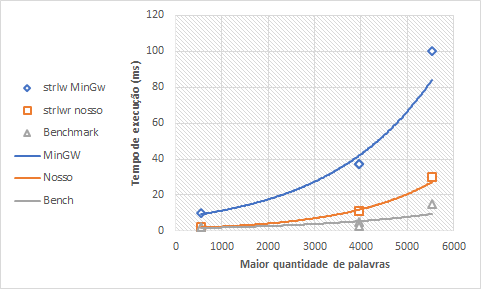

# Trabalho Final de Estruturas de Dados

## Objetivo

Computar a Similaridade de Jacquard entre dois textos, definida como:

$$ Sim = \frac{\left| Texto_A \bigcap Texto_B \right|}{\left| Texto_A \bigcup Texto_B\right|} = \frac{\left| Texto_A
\bigcap Texto_B \right|}{\left| Texto_A \right| + \left| Texto_B \right| - \left| Texto_A \bigcap Texto_B \right|} $$

## Implementação

Utilizamos a Árvore Rubro-negra (RB), escolhida por sua facilidade de realizar
certas operações em árvores com muitos elementos.

Sendo uma Árvore Binária de Pesquisa (ABP), as RBs, usam as cores vermelha
e preta para determinar se há ou não necessidade de realizar rotações na
árvore, simplificando operações de inserção e remoção quando comparadas
às Árvores AVL, que possuem uma estrutura muito mais rígida.

Enquanto as AVLs possuem uma estrutura mais compacta, ou seja, nodos
mais perto da raiz, resultando em pesquisas mais rápidas. Já as RBs
possuem uma estrutura mais aberta, permitindo subárvores com até dois
níveis de diferença, resultando em pesquisas mais lentas (mas não diferem
de maneira absurda, como pode ser observado a seguir).

Isso se deve ao fato de que a altura h, de uma árvore AVL, se relaciona
à quantidade $n$ de nodos, conforme Knebl (2019), da seguinte maneira

$$ h < 1,45 \log_2(n+2)-1,33 $$

com complexidade $O(\log(n))$ para buscas. E, uma RB (Segundo Knebl
(2019), árvores Rubro-Negras são equivalentes à B-trees de ordem 4) possui

$$ h \leq \log_2(n+12) $$

com complexidade $O(\log_2(n+12))$ para buscas.

Por fim, com relação às árvores Splay, não fazem sentido no contexto
do programa, as repetições de palavras são ignoradas, então não há
vantagem em ter os nodos mais acessados perto da raiz. Além de que,
outra razão para não usar as Splays, é o fato que a interseção entre
as duas árvores é feita de maneira tal que os nodos são ordenados de
maneira crescente. O que implicaria no menor desempenho possível destas árvores.

O programa criado, lê três arquivos: texto A, texto B e uma lista de
stopwords. Para cada um desses arquivos foi implementado uma árvore RB,
para que apenas palavras distintas fossem carregadas, ignorando,
nas árvores dos textos A e B, as palavras contidas nas stopwords.

E, para encontrar a interseção entre os dois textos A e B, foi criada
uma estrutura de lista de nodos da menor árvore, visando diminuir a
quantidade de pesquisas realizadas na árvore.

## Otimização

Como forma de otimização foi realizada uma implementação do algoritmo
_jump search_, feito usando como base a característica ordenada
das ABPs, através do caminhamento pré-fixado à esquerda. A ideia era
diminuir as comparações entre strings realizadas pelo programa e obter
uma pequena área para busca linear.

O resultado, no entanto, ficou aquém do esperado, com o desempenho,
em média, 5x vezes mais lenta para o caso mais simples, ou seja,
muito inferior à pesquisa padrão de uma ABP.

Outra otimização, e esta sim teve bons resultados, foi a implementação
própria da função `strlwr`, uma função presente no pacote MinGW, não sendo
padrão da linguagem c, não saberíamos descrever o motivo disto, uma vez
que a implementação feita é basicamente a mesma presente no MinGW,
certamente há outros fatores envolvidos. Isto, na verdade, foi descoberto
por acaso, uma vez que se objetivava a execução do programa na plataforma
Linux, e, como não possuía o `strlwr`, precisávamos implementá-la.

Otimizações, no entanto, deveriam ser com base nos gargalos do programa,
isto é, buscando blocos que, o programa, na sua execução, passe bastante
tempo. Esta análise é obtida através do profiling do programa, mas, devido
à falta de conhecimento, não foi possível realizar.

## Resultados

Abaixo apresentamos uma tabela com os resultados obtidos da execução do
programa, para tanto, foram feitas 8 execuções do programa, obtendo a média
aproximada de cada execução.

Todas as execuções foram feitas com textos fornecidos para verificar o
funcionamento do programa.

É apresentando, também, o resultado da execução com `strlwr` do MinGW e
nosso, além do resultado descrito com os arquivos de teste,
usando como benchmark.

**Tabela 1:** resultados da execução

| Texto A | Texto B | strlwr MinGW (ms) | strlwr nosso (ms) | Benchmark (ms) | Jaccard |
|---------|---------|-------------------|-------------------|----------------|---------|
| 471     | 539     | 10                | 2                 | 2              | 0,11    |
| 471     | 3967    | 37                | 11                | 5              | 0,12    |
| 539     | 3967    | 37                | 11                | 3              | 0,12    |
| 3967    | 5524    | 100               | 30                | 15             | 0,22    |

Logo abaixo apresentamos um gráfico que mostra a tendência nos
tempos de execução do programa, tendo como base a quantidade de
palavras do maior texto, uma vez que a busca das palavras presentes
em ambos os textos é efetuada na maior árvore. Onde pode ser observado
a disparidade entre as diferentes implementações da função `strlwr`.

**Figura 1:** tendências nos tempos de execuções

## Bibliografia

KNEBL, H. **Algorithms and Data Structures**: foundations and probabilistic
methods for design and analysis. Nürnberg, Alemanha: Springer. 2019.

## Nota

A implementação do _jump search_ para buscas na árvore pode ser
vista na branch `jump_search`.
